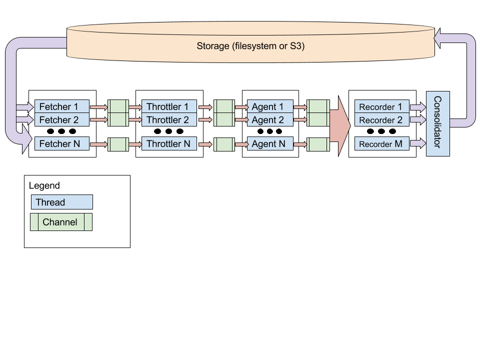

# requestinator

A Clojure library designed to generate and execute requests against a
web service based on a [Swagger](http://swagger.io) specification.

## Config File Formats

There are several example files in the [resources](resources) folder.
In particular, check out the fully-annotated
[petstore-mixed.edn](resources/petstore-mixed.edn) example.

## Build a Docker Image

Docker image names are based on the git revision. The following
sequence of commands will build a docker image named
`requestinator:v1.2.3`. It will also tag it `latest`.

```
git commit -am "Message for commit"
git tag v1.2.3
bin/build
```

## Generating Requests

### Run Via Leinginen Against the Local Filesystem

Generate three indepdendent, random sequences of requests based on the
[Petstore Sample Service](http://petstore.swagger.io/), and save it to
`/tmp/requestinator-test`. Requests will be scheduled on average
twice a second for each of the three agents, and 60 seconds worth of
data will be generated.

```
lein run generate --destination file:///tmp/requestinator-test --params resources/petstore-mixed.edn
```

### Run Via Docker Against S3

```
docker run -e AWS_ACCESS_KEY_ID -e AWS_SECRET_KEY requestinator generate --destination s3://com.cognitect.requestinator.test/readme-example --params resources/petstore-mixed.edn
```

This example assumes you have `AWS_ACCESS_KEY` and `AWS_SECRET_KEY` environment variables set to provide access to the `com.cognitect.requestinator.test` bucket.

## Executing Requests

### Run Via Leingen Against the Local Filesystem

```
lein run execute --source file:///tmp/requestinator-test --destination file:///tmp/requestinator-test/results --recorder-concurrency 3
```

### Run Via Docker Against S3

```
docker run -e AWS_ACCESS_KEY_ID -e AWS_SECRET_KEY requestinator execute --source s3://com.cognitect.requestinator.test/readme-example --destination s3://com.cognitect.requestinator.test/readme-example/results --recorder-concurrency 3
```

## Generating Reports

### Run Via Leingen Against the Local Filesystem

```
lein run report --source file:///tmp/requestinator-test/results --destination file:///tmp/requestinator-test/reports
```

Open `/tmp/requestinator-test/reports/main/html/index.html` to view.
There is one row for each agent, in which triangles represent
requests, positioned horizontally according to the time they were
executed. The length of the solid rectangle indicates the duration.
Hover over a request to see its details in the lower pane. Click one
to "lock" it. Hold shift and scroll to zoom the time dimension in and
out.

## Architecture

### Execution



## TODO

- Implement the rest of Swagger. Pretty good coverage at the moment,
  but definitely some of the spec is not implemented. Partial list:
  - [ ] Support for `required` being false
  - [ ] Support for XML
  - [ ] Overriding consumes
- Implement the rest of [JSON Pointer](http://tools.ietf.org/html/rfc6901).
- Improve tests

## License

Copyright © 2016 Cognitect, Inc.

